# Project Management System - Task Breakdown

## Executive Summary

본 문서는 PMS(Project Management System) 개발을 위한 상세 작업 분류입니다. 총 **5 개 페이즈**로 구성되며, **87 개 아톰릭 작업(Task)**이 정의되어 있습니다.

### 프로젝트 개요
- **유형**: 웹 애플리케이션 (React + TypeScript), 모바일 (React Native), 백엔드 (Node.js + Express/NestJS + PostgreSQL)
- **주요 기능**: Gantt 차트, 역할 기반 액세스 제어 (RBAC), 프로젝트 CRUD, 일정 관리
- **역할**: Project Manager (PM), Administrator

### 작업 분포
| 레이어 | 작업 수 | 주 페이즈 |
|--------|---------|-----------|
| Database | 12 | Foundation, Core |
| Backend/API | 28 | Foundation, Core, Quality |
| Frontend/Web | 25 | Foundation, Core, UX |
| Mobile | 15 | Mobile |
| DevOps | 5 | Quality, Deployment |
| QA | 2 | Quality |

### 총 작업 우선순위 분포
- **P0-Critical**: 18 개 (인증, RBAC, 핵심 CRUD)
- **P1-High**: 35 개 (Gantt, 작업 관리, 일정)
- **P2-Medium**: 28 개 (대시보드, 알림, UI)
- **P3-Low**: 6 개 (보조 기능)

---

## Phase 1: Foundation (기초 구축)

**목표**: 데이터베이스 설계, 인증 시스템, 기본 프로젝트 CRUD 구현

### Phase 1 Summary
| Task ID | Task Name | Layer | Priority | Complexity |
|---------|-----------|-------|----------|------------|
| TSK-001 | Database Schema Design | Database | P0 | High |
| TSK-002 | User Model & Migration | Database | P0 | Medium |
| TSK-003 | Project Model & Migration | Database | P0 | Medium |
| TSK-004 | Task Model & Migration | Database | P1 | Medium |
| TSK-005 | Relationship Migrations | Database | P1 | Low |
| TSK-006 | Express/NestJS Project Setup | Backend/API | P0 | Low |
| TSK-007 | Database Connection Setup | Backend/API | P0 | Low |
| TSK-008 | JWT Authentication Middleware | Backend/API | P0 | High |
| TSK-009 | User Registration API | Backend/API | P0 | Medium |
| TSK-010 | User Login API | Backend/API | P0 | Medium |
| TSK-011 | Role-Based Access Control Middleware | Backend/API | P0 | High |
| TSK-012 | User Profile API | Backend/API | P1 | Low |
| TSK-013 | React + TypeScript Project Setup | Frontend/Web | P0 | Low |
| TSK-014 | Authentication Service (Frontend) | Frontend/Web | P0 | Medium |
| TSK-015 | Login Page UI | Frontend/Web | P1 | Medium |
| TSK-016 | Registration Page UI | Frontend/Web | P1 | Medium |
| TSK-017 | Auth Context/State Management | Frontend/Web | P1 | Medium |
| TSK-018 | Project Service API Client | Frontend/Web | P0 | Medium |
| TSK-019 | Project CRUD API Implementation | Backend/API | P0 | High |
| TSK-020 | Project List View (Web) | Frontend/Web | P1 | Medium |
| TSK-021 | Project Detail View (Web) | Frontend/Web | P1 | Medium |
| TSK-022 | Project Create/Edit Form (Web) | Frontend/Web | P1 | Medium |

---

## Phase 2: Core Features (핵심 기능)

**목표**: 작업 관리, Gantt 차트 구현, 일정 관리

### Phase 2 Summary
| Task ID | Task Name | Layer | Priority | Complexity |
|---------|-----------|-------|----------|------------|
| TSK-023 | Task Model Enhancement | Database | P0 | Low |
| TSK-024 | Task CRUD API | Backend/API | P0 | High |
| TSK-025 | Task Assignment API | Backend/API | P1 | Medium |
| TSK-026 | Task Status Update API | Backend/API | P1 | Low |
| TSK-027 | Task List Component (Web) | Frontend/Web | P0 | Medium |
| TSK-028 | Task Detail Modal (Web) | Frontend/Web | P1 | Medium |
| TSK-029 | Task Create/Edit Form (Web) | Frontend/Web | P1 | Medium |
| TSK-030 | Task Assignment UI | Frontend/Web | P1 | Medium |
| TSK-031 | Schedule Model & Migration | Database | P0 | Medium |
| TSK-032 | Schedule CRUD API | Backend/API | P0 | High |
| TSK-033 | Schedule Dependency API | Backend/API | P1 | High |
| TSK-034 | Gantt Chart Library Integration (Web) | Frontend/Web | P0 | High |
| TSK-035 | Gantt Chart Component (Web) | Frontend/Web | P0 | High |
| TSK-036 | Gantt Timeline Navigation (Web) | Frontend/Web | P1 | Medium |
| TSK-037 | Gantt Task Bar Interactions (Web) | Frontend/Web | P1 | High |
| TSK-038 | Gantt Drag-and-Drop (Web) | Frontend/Web | P1 | High |
| TSK-039 | Schedule View UI (Web) | Frontend/Web | P1 | Medium |
| TSK-040 | Timeline API for Gantt | Backend/API | P0 | Medium |
| TSK-041 | Resource Allocation API | Backend/API | P1 | Medium |
| TSK-042 | Calendar Integration API | Backend/API | P1 | Medium |

---

## Phase 3: User Experience (사용자 경험)

**목표**: 대시보드, 보고서, 알림, 반응형 UI

### Phase 3 Summary
| Task ID | Task Name | Layer | Priority | Complexity |
|---------|-----------|-------|----------|------------|
| TSK-043 | Dashboard Data API | Backend/API | P0 | Medium |
| TSK-044 | Project Statistics API | Backend/API | P1 | Medium |
| TSK-045 | User Activity API | Backend/API | P1 | Low |
| TSK-046 | Dashboard Component (Web) | Frontend/Web | P0 | High |
| TSK-047 | Project Overview Widget (Web) | Frontend/Web | P1 | Medium |
| TSK-048 | Task Status Chart (Web) | Frontend/Web | P1 | Medium |
| TSK-049 | Team Workload Widget (Web) | Frontend/Web | P1 | Medium |
| TSK-050 | Notification Model & Migration | Database | P1 | Medium |
| TSK-051 | Notification Service API | Backend/API | P1 | High |
| TSK-052 | WebSocket Connection Setup | Backend/API | P1 | Medium |
| TSK-053 | Real-time Notification System | Backend/API | P1 | High |
| TSK-054 | Notification Center Component (Web) | Frontend/Web | P1 | Medium |
| TSK-055 | Toast Notification Component (Web) | Frontend/Web | P2 | Low |
| TSK-056 | Email Notification Template | Backend/API | P2 | Medium |
| TSK-057 | Report Generation API | Backend/API | P2 | Medium |
| TSK-058 | Project Report Component (Web) | Frontend/Web | P2 | Medium |
| TSK-059 | Responsive Layout System | Frontend/Web | P1 | High |
| TSK-060 | Mobile-Responsive Gantt (Web) | Frontend/Web | P2 | High |
| TSK-061 | Accessibility Improvements | Frontend/Web | P2 | Medium |
| TSK-062 | Theme/CSS System Refinement | Frontend/Web | P2 | Low |

---

## Phase 4: Mobile (모바일)

**목표**: React Native 애플리케이션, 모바일 특성 기능, 백엔드 연동

### Phase 4 Summary
| Task ID | Task Name | Layer | Priority | Complexity |
|---------|-----------|-------|----------|------------|
| TSK-063 | React Native Project Setup | Mobile | P0 | Low |
| TSK-064 | React Native Navigation Setup | Mobile | P0 | Medium |
| TSK-065 | Mobile Authentication Service | Mobile | P0 | Medium |
| TSK-066 | Mobile Login Screen | Mobile | P1 | Medium |
| TSK-067 | Main Tab Navigation (Mobile) | Mobile | P0 | Medium |
| TSK-068 | Mobile Project List Screen | Mobile | P0 | Medium |
| TSK-069 | Mobile Project Detail Screen | Mobile | P1 | Medium |
| TSK-070 | Mobile Task List Screen | Mobile | P0 | Medium |
| TSK-071 | Mobile Task Detail Screen | Mobile | P1 | Medium |
| TSK-072 | Mobile Task Create/Edit Screen | Mobile | P1 | Medium |
| TSK-073 | Mobile Gantt Chart Component | Mobile | P1 | High |
| TSK-074 | Mobile Schedule View Screen | Mobile | P1 | Medium |
| TSK-075 | Mobile Dashboard Screen | Mobile | P1 | Medium |
| TSK-076 | Mobile Notification Screen | Mobile | P2 | Medium |
| TSK-077 | Offline Sync Service | Mobile | P1 | High |

---

## Phase 5: Quality & Deployment (품질 및 배포)

**목표**: 테스팅, CI/CD, 문서화

### Phase 5 Summary
| Task ID | Task Name | Layer | Priority | Complexity |
|---------|-----------|-------|----------|------------|
| TSK-078 | Unit Test Setup (Backend) | QA | P0 | Medium |
| TSK-079 | Unit Test Setup (Frontend) | QA | P0 | Medium |
| TSK-080 | Unit Test Setup (Mobile) | QA | P1 | Medium |
| TSK-081 | API Integration Tests | QA | P0 | High |
| TSK-082 | E2E Test Setup (Web) | QA | P0 | High |
| TSK-083 | E2E Test Scenarios (Web) | QA | P0 | High |
| TSK-084 | Docker Configuration | DevOps | P0 | Medium |
| TSK-085 | Docker Compose for Development | DevOps | P0 | Medium |
| TSK-086 | CI/CD Pipeline Setup | DevOps | P0 | High |
| TSK-087 | Production Deployment Setup | DevOps | P0 | High |
| TSK-088 | API Documentation (Swagger) | Backend/API | P1 | Medium |
| TSK-089 | User Documentation | DevOps | P2 | Low |
| TSK-090 | Developer Setup Guide | DevOps | P1 | Medium |

---

## Dependency Graph

```mermaid
graph TD
    subgraph Phase1_Foundation["Phase 1: Foundation"]
        TSK-001[DB Schema Design]
        TSK-002[User Model]
        TSK-003[Project Model]
        TSK-004[Task Model]
        TSK-005[Relationships]
        
        TSK-006[Express Setup]
        TSK-007[DB Connection]
        TSK-008[JWT Auth]
        TSK-009[User Register API]
        TSK-010[User Login API]
        TSK-011[RBAC Middleware]
        TSK-012[User Profile API]
        
        TSK-013[React Setup]
        TSK-014[Auth Service]
        TSK-015[Login UI]
        TSK-016[Register UI]
        TSK-017[Auth Context]
        TSK-018[API Client]
        
        TSK-019[Project CRUD API]
        TSK-020[Project List UI]
        TSK-021[Project Detail UI]
        TSK-022[Project Form UI]
    end
    
    subgraph Phase2_Core["Phase 2: Core Features"]
        TSK-023[Task Model Enhance]
        TSK-024[Task CRUD API]
        TSK-025[Task Assignment API]
        TSK-026[Task Status API]
        
        TSK-027[Task List UI]
        TSK-028[Task Detail UI]
        TSK-029[Task Form UI]
        TSK-030[Task Assignment UI]
        
        TSK-031[Schedule Model]
        TSK-032[Schedule CRUD API]
        TSK-033[Schedule Dependency API]
        
        TSK-034[Gantt Library]
        TSK-035[Gantt Component]
        TSK-036[Gantt Timeline]
        TSK-037[Gantt Interactions]
        TSK-038[Gantt Drag-Drop]
        
        TSK-039[Schedule View UI]
        TSK-040[Timeline API]
        TSK-041[Resource API]
        TSK-042[Calendar API]
    end
    
    subgraph Phase3_UX["Phase 3: User Experience"]
        TSK-043[Dashboard API]
        TSK-044[Stats API]
        TSK-045[Activity API]
        
        TSK-046[Dashboard UI]
        TSK-047[Overview Widget]
        TSK-048[Status Chart]
        TSK-049[Workload Widget]
        
        TSK-050[Notification Model]
        TSK-051[Notification Service]
        TSK-052[WebSocket]
        TSK-053[Real-time]
        TSK-054[Notification Center]
        TSK-055[Toast Component]
        
        TSK-056[Email Templates]
        TSK-057[Report API]
        TSK-058[Report UI]
        
        TSK-059[Responsive Layout]
        TSK-060[Responsive Gantt]
        TSK-061[Accessibility]
        TSK-062[Theme System]
    end
    
    subgraph Phase4_Mobile["Phase 4: Mobile"]
        TSK-063[React Native Setup]
        TSK-064[Navigation Setup]
        TSK-065[Mobile Auth]
        TSK-066[Mobile Login]
        TSK-067[Tab Nav]
        
        TSK-068[Project List]
        TSK-069[Project Detail]
        TSK-070[Task List]
        TSK-071[Task Detail]
        TSK-072[Task Form]
        
        TSK-073[Gantt Mobile]
        TSK-074[Schedule Mobile]
        TSK-075[Dashboard Mobile]
        TSK-076[Notification Mobile]
        TSK-077[Offline Sync]
    end
    
    subgraph Phase5_Quality["Phase 5: Quality & Deployment"]
        TSK-078[Backend Unit Tests]
        TSK-079[Frontend Unit Tests]
        TSK-080[Mobile Unit Tests]
        TSK-081[Integration Tests]
        TSK-082[E2E Setup]
        TSK-083[E2E Scenarios]
        
        TSK-084[Docker Config]
        TSK-085[Docker Compose]
        TSK-086[CI/CD Pipeline]
        TSK-087[Prod Deployment]
        
        TSK-088[API Docs]
        TSK-089[User Docs]
        TSK-090[Dev Guide]
    end
    
    %% Phase 1 Dependencies
    TSK-001 --> TSK-002
    TSK-001 --> TSK-003
    TSK-001 --> TSK-004
    TSK-002 --> TSK-005
    TSK-003 --> TSK-005
    TSK-004 --> TSK-005
    
    TSK-006 --> TSK-007
    TSK-002 --> TSK-007
    TSK-007 --> TSK-008
    TSK-008 --> TSK-009
    TSK-009 --> TSK-010
    TSK-008 --> TSK-011
    TSK-011 --> TSK-012
    TSK-010 --> TSK-012
    
    TSK-013 --> TSK-014
    TSK-009 --> TSK-014
    TSK-010 --> TSK-014
    TSK-014 --> TSK-015
    TSK-014 --> TSK-016
    TSK-014 --> TSK-017
    
    TSK-003 --> TSK-019
    TSK-004 --> TSK-019
    TSK-011 --> TSK-019
    TSK-019 --> TSK-020
    TSK-020 --> TSK-021
    TSK-019 --> TSK-022
    
    TSK-017 --> TSK-018
    TSK-018 --> TSK-020
    TSK-018 --> TSK-021
    TSK-018 --> TSK-022
    
    %% Phase 2 Dependencies
    TSK-019 --> TSK-024
    TSK-004 --> TSK-023
    TSK-023 --> TSK-024
    TSK-002 --> TSK-025
    TSK-024 --> TSK-025
    TSK-024 --> TSK-026
    
    TSK-024 --> TSK-027
    TSK-027 --> TSK-028
    TSK-024 --> TSK-029
    TSK-025 --> TSK-030
    
    TSK-003 --> TSK-031
    TSK-004 --> TSK-031
    TSK-031 --> TSK-032
    TSK-031 --> TSK-033
    TSK-032 --> TSK-033
    
    TSK-034 --> TSK-035
    TSK-035 --> TSK-036
    TSK-035 --> TSK-037
    TSK-037 --> TSK-038
    TSK-032 --> TSK-035
    TSK-040 --> TSK-035
    
    TSK-032 --> TSK-039
    TSK-040 --> TSK-039
    
    TSK-031 --> TSK-040
    TSK-002 --> TSK-041
    TSK-003 --> TSK-041
    TSK-031 --> TSK-042
    
    %% Phase 3 Dependencies
    TSK-003 --> TSK-043
    TSK-002 --> TSK-043
    TSK-004 --> TSK-043
    TSK-043 --> TSK-044
    TSK-002 --> TSK-045
    TSK-045 --> TSK-043
    
    TSK-043 --> TSK-046
    TSK-044 --> TSK-046
    TSK-003 --> TSK-047
    TSK-046 --> TSK-047
    TSK-044 --> TSK-048
    TSK-046 --> TSK-048
    TSK-045 --> TSK-049
    TSK-046 --> TSK-049
    
    TSK-003 --> TSK-050
    TSK-050 --> TSK-051
    TSK-011 --> TSK-051
    TSK-008 --> TSK-052
    TSK-051 --> TSK-052
    TSK-052 --> TSK-053
    TSK-053 --> TSK-054
    TSK-051 --> TSK-055
    
    TSK-051 --> TSK-056
    TSK-003 --> TSK-057
    TSK-057 --> TSK-058
    TSK-044 --> TSK-058
    
    TSK-013 --> TSK-059
    TSK-035 --> TSK-060
    TSK-059 --> TSK-060
    TSK-059 --> TSK-061
    TSK-059 --> TSK-062
    
    %% Phase 4 Dependencies
    TSK-008 --> TSK-063
    TSK-006 --> TSK-064
    TSK-063 --> TSK-064
    TSK-010 --> TSK-065
    TSK-065 --> TSK-066
    TSK-064 --> TSK-067
    TSK-003 --> TSK-068
    TSK-067 --> TSK-068
    TSK-068 --> TSK-069
    TSK-004 --> TSK-070
    TSK-067 --> TSK-070
    TSK-070 --> TSK-071
    TSK-004 --> TSK-072
    TSK-067 --> TSK-072
    TSK-034 --> TSK-073
    TSK-073 --> TSK-074
    TSK-043 --> TSK-075
    TSK-053 --> TSK-076
    TSK-067 --> TSK-076
    TSK-031 --> TSK-077
    
    %% Phase 5 Dependencies
    TSK-006 --> TSK-078
    TSK-013 --> TSK-079
    TSK-063 --> TSK-080
    TSK-006 --> TSK-081
    TSK-013 --> TSK-082
    TSK-082 --> TSK-083
    TSK-078 --> TSK-081
    TSK-079 --> TSK-081
    TSK-081 --> TSK-083
    
    TSK-006 --> TSK-084
    TSK-084 --> TSK-085
    TSK-078 --> TSK-086
    TSK-079 --> TSK-086
    TSK-080 --> TSK-086
    TSK-085 --> TSK-086
    TSK-086 --> TSK-087
    
    TSK-006 --> TSK-088
    TSK-088 --> TSK-090
    TSK-087 --> TSK-089
```



---

## Development Checklist (TDD / Spec-Driven)

### Phase 1: Foundation

#### TSK-001: Database Schema Design
- **Test 파일**: `tests/schema/schema.validation.test.ts`
- **Spec 문서**: `docs/specs/database-schema.md`
- **체크포인트**:
  - [ ] ERD 도면 검토 완료
  - [ ] 관계 무결성 규칙 정의
  - [ ] 인덱스 전략 문서화

#### TSK-008: JWT Authentication Middleware
- **Test 파일**: `tests/middleware/auth.middleware.test.ts`
- **Spec 문서**: `docs/specs/authentication.md`
- **체크포인트**:
  - [ ] 토큰 생성/검증 로직 테스트
  - [ ] 만료 처리 로직 테스트
  - [ ] 보안 헤더 검증 테스트

#### TSK-011: Role-Based Access Control Middleware
- **Test 파일**: `tests/middleware/rbac.middleware.test.ts`
- **Spec 문서**: `docs/specs/rbac.md`
- **체크포인트**:
  - [ ] PM 역할 권한 테스트
  - [ ] Administrator 역할 권한 테스트
  - [ ] 권한 없는 접근 거부 테스트

#### TSK-019: Project CRUD API Implementation
- **Test 파일**: `tests/api/project.api.test.ts`
- **Spec 문서**: `docs/specs/project-crud.md`
- **체크포인트**:
  - [ ] CREATE: 프로젝트 생성 검증
  - [ ] READ: 프로젝트 목록/상세 조회
  - [ ] UPDATE: 프로젝트 수정 검증
  - [ ] DELETE: 프로젝트 삭제 검증
  - [ ] RBAC 적용 검증

#### TSK-018: Project Service API Client
- **Test 파일**: `tests/services/project.service.test.ts`
- **Spec 문서**: `docs/specs/frontend-services.md`
- **체크포인트**:
  - [ ] API 호출 모킹 테스트
  - [ ] 에러 처리 테스트
  - [ ] 인터셉터 테스트

### Phase 2: Core Features

#### TSK-024: Task CRUD API
- **Test 파일**: `tests/api/task.api.test.ts`
- **Spec 문서**: `docs/specs/task-management.md`
- **체크포인트**:
  - [ ] 작업 생성/수정/삭제/조회
  - [ ] 소속 프로젝트 검증
  - [ ] 작업자 할당 검증

#### TSK-034: Gantt Chart Library Integration
- **Test 파일**: `tests/utils/gantt.integration.test.ts`
- **Spec 문서**: `docs/specs/gantt-chart.md`
- **체크포인트**:
  - [ ] 라이브러리 선택 검증 (dhtmlxGantt/jspdf-gantt)
  - [ ] 데이터 매핑 테스트
  - [ ] 렌더링 성능 테스트

#### TSK-035: Gantt Chart Component
- **Test 파일**: `tests/components/GanttChart.test.tsx`
- **Spec 문서**: `docs/specs/gantt-component.md`
- **체크포인트**:
  - [ ] 차트 렌더링 테스트
  - [ ] 타임라인 변환 테스트
  - [ ] 마진/패딩 검증

#### TSK-038: Gantt Drag-and-Drop
- **Test 파일**: `tests/components/Gantt.dragdrop.test.tsx`
- **Spec 문서**: `docs/specs/gantt-interactions.md`
- **체크포인트**:
  - [ ] 드래그 시작 테스트
  - [ ] 드롭 위치 검증
  - [ ] 일정 변경 API 연동 테스트

#### TSK-032: Schedule CRUD API
- **Test 파일**: `tests/api/schedule.api.test.ts`
- **Spec 문서**: `docs/specs/schedule-management.md`
- **체크포인트**:
  - [ ] 일정 생성/수정/삭제
  - [ ] 의존성 검증
  - [ ] 충돌 감지 로직

### Phase 3: User Experience

#### TSK-043: Dashboard Data API
- **Test 파일**: `tests/api/dashboard.api.test.ts`
- **Spec 문서**: `docs/specs/dashboard-api.md`
- **체크포인트**:
  - [ ] 집계 쿼리 검증
  - [ ] 성능 테스트
  - [ ] 캐싱 로직 검증

#### TSK-046: Dashboard Component
- **Test 파일**: `tests/components/Dashboard.test.tsx`
- **Spec 문서**: `docs/specs/dashboard-ui.md`
- **체크포인트**:
  - [ ] 위젯 렌더링 테스트
  - [ ] 데이터 바인딩 테스트
  - [ ] 반응형 검증

#### TSK-052: WebSocket Connection Setup
- **Test 파일**: `tests/utils/websocket.test.ts`
- **Spec 문서**: `docs/specs/realtime.md`
- **체크포인트**:
  - [ ] 연결/재연결 테스트
  - [ ] 메시지 발송 테스트
  - [ ] 인증 검증

#### TSK-059: Responsive Layout System
- **Test 파일**: `tests/utils/responsive.test.ts`
- **Spec 문서**: `docs/specs/responsive-design.md`
- **체크포인트**:
  - [ ] breakpoints 검증
  - [ ] 플렉스/그리드 테스트
  - [ ] 모바일/태블릿/데스크톱 검증

### Phase 4: Mobile

#### TSK-063: React Native Project Setup
- **Test 파일**: `tests/setup/mobile.setup.test.ts`
- **Spec 문서**: `docs/specs/mobile-project.md`
- **체크포인트**:
  - [ ] 라이브러리 설치 검증
  - [ ] 네이티브 모듈 설정
  - [ ] 개발 환경 테스트

#### TSK-073: Mobile Gantt Chart Component
- **Test 파일**: `tests/components/MobileGantt.test.tsx`
- **Spec 문서**: `docs/specs/mobile-gantt.md`
- **체크포인트**:
  - [ ] 터치 인터랙션 테스트
  - [ ] 스크롤 성능 테스트
  - [ ] 오프라인 모드 테스트

#### TSK-077: Offline Sync Service
- **Test 파일**: `tests/services/offline-sync.test.ts`
- **Spec 문서**: `docs/specs/offline-sync.md`
- **체크포인트**:
  - [ ] 로컬 스토리지 연동
  - [ ] 동기화 로직 테스트
  - [ ] 충돌 해결 전략

### Phase 5: Quality & Deployment

#### TSK-078: Unit Test Setup (Backend)
- **Test 파일**: `tests/setup/jest.config.js`, `tests/setup/tsconfig.json`
- **Spec 문서**: `docs/specs/testing-setup.md`
- **체크포인트**:
  - [ ] Jest 설정 검증
  - [ ] 모킹 환경 테스트
  - [ ] 커버리지 임계값 설정

#### TSK-082: E2E Test Setup (Web)
- **Test 파일**: `tests/e2e/setup/cypress.config.ts`
- **Spec 문서**: `docs/specs/e2e-testing.md`
- **체크포인트**:
  - [ ] Cypress/Playwright 설정
  - [ ] 테스트 데이터 세팅
  - [ ] 스크린샷 검증

#### TSK-086: CI/CD Pipeline Setup
- **Test 파일**: `.github/workflows/ci.yml`
- **Spec 문서**: `docs/specs/cicd.md`
- **체크포인트**:
  - [ ] 빌드 워크플로우 검증
  - [ ] 테스트 자동화 검증
  - [ ] 배포 워크플로우 검증

---

## Task Status Template

각 작업 진행 상황 추적용 템플릿:

```markdown
## [Task ID] Task Name

- **상태**: [ ] Pending / [ ] In Progress / [ ] Completed / [ ] Blocked
- **시작일**: YYYY-MM-DD
- **완료일**: YYYY-MM-DD
- **진행률**: 0-100%

### Test Files Created
- [ ] tests/...

### Spec Documents Created
- [ ] docs/specs/...

### Code Review Checkpoints
- [ ] Code review 1 완료
- [ ] Code review 2 완료
- [ ] 최종 승인

### Notes
- 문제사항:
- 해결사항:
```

---

## Appendix: Complexity Definitions

| Complexity | 설명 | 예상 작업 시간 |
|------------|------|---------------|
| Low | 간단한 구현, 1-2 일 | < 16 시간 |
| Medium | 중간 복잡도, 3-5 일 | 16-40 시간 |
| High | 복잡한 로직, 6-10 일 | 40-80 시간 |

## Appendix: Priority Definitions

| Priority | 설명 | 처리 기준 |
|----------|------|-----------|
| P0-Critical | 시스템 기본 기능, 없으면 작동 불가 | 즉시 완료 |
| P1-High | 핵심 기능, 필수적 | 1 스프린트 내 완료 |
| P2-Medium | 개선 기능, 유용함 | 2-3 스프린트 내 |
| P3-Low | 보조 기능, 선택적 | 백로그 유지 |

---

## Document Information

- **문서 버전**: 1.0
- **작성일**: 2026-04-09
- **작성자**: System
- **최종 업데이트**: 2026-04-09

---

*본 문서는 개발 진행 상황에 따라 수정될 수 있습니다.*
